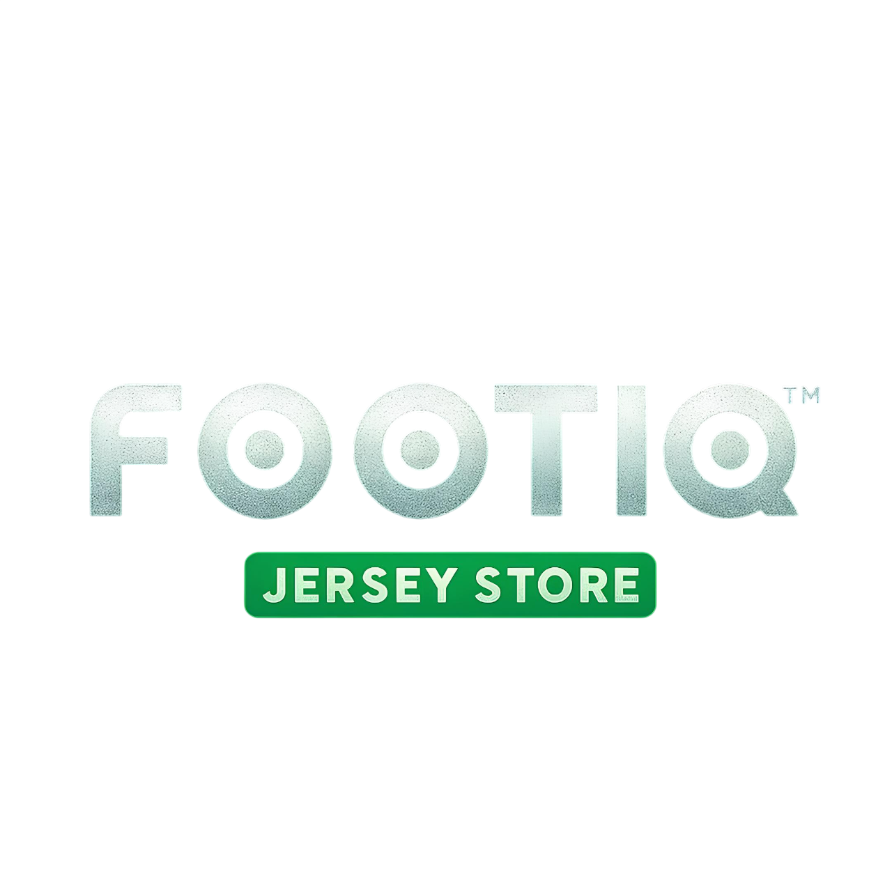

<div align="center">
  
  <h1>⚽ FOOTIQ Jersey Store — Official Website ⚽</h1>
  <p>
    <a href="https://arbcreations32.github.io/footiq/">
      
    </a>
  </p>
</div>

---

## 📖 About the Project

**[Footiq Jersey Store](https://arbcreations32.github.io/footiq/)** is a premium football jersey brand based in Kerala, India. This project is the official showcase website designed with a cinematic, dark luxury sportswear aesthetic.

> **Note:** This is a catalogue and showcase website, *not* a traditional e-commerce site with a cart checkout. Users browse the premium collection online and are directed to contact the team via **WhatsApp** or **Instagram Direct Message** to place their orders.

## 🚀 Live Demo

**[View the Live Website Here: arbcreations32.github.io/footiq](https://arbcreations32.github.io/footiq/)**

## 📄 Pages

The website is composed of four main static pages:

- **`index.html`** - **Home**: Features an animated aurora hero section, live stats counter, featured category drops, and a marquee trust bar.
- **`catalogue.html`** - **Catalogue**: A complete dynamic grid view of all jerseys, complete with a sticky category filter bar, live text search, and pre-filled WhatsApp "Order Now" buttons.
- **`about.html`** - **Our Story**: Details the brand's origins rooted in Kerala, core differentiators (fabric grading, embroidery), and customisation services.
- **`contact.html`** - **Contact Options**: A visual 4-step ordering guide, quick-action contact cards, a community join banner, and an interactive FAQ accordion.

## 💻 Tech Stack

- **Pure HTML5** for semantic structure.
- **CSS3** via a shared `style.css` utilizing custom properties, dark mode styling, and pure CSS keyframe animations (Aurora background, infinite marquee).
- **Vanilla JavaScript (ES6)** handling IntersectionObserver scroll reveals, mobile navigation, stat counters, and dynamic catalogue rendering (`catalogue.js`).
- **Google Fonts**: Bebas Neue (Headings) & DM Sans (Body).
- **Icons**: Font Awesome 6 CDN.
- *Zero dependencies, zero build steps, completely static and standalone.*

## 📁 Folder Structure

```text
footiq/
├── index.html
├── catalogue.html
├── about.html
├── contact.html
├── css/
│   └── style.css
├── js/
│   ├── main.js
│   └── catalogue.js
└── assets/
    ├── logo.png
    ├── Ac Milan kits/
    ├── Anime kits/
    ├── Argentina kits/
    ├── Barca kits/
    ├── Beckham kits/
    ├── Brazil kits/
    ├── CR7 Kits/
    ├── Cricket Kits/
    ├── Full sleeve kits/
    ├── Half sleeves kits/
    ├── Kaka kits/
    ├── Maldini kits/
    ├── Man united kits/
    ├── Messi Kits/
    ├── National team kits/
    ├── Neymar Kits/
    ├── Oversized kits/
    ├── Polo collar kits/
    ├── Real Madrid kits/
    ├── Shorts/
    ├── Sleeveless kits/
    ├── Special editions/
    └── Zidane kits/
```

## 🛠️ How to Run Locally

Because this is a fully static website, running it locally is extremely straightforward.

```bash
# Clone the repository
git clone https://github.com/arbcreations32/footiq.git
cd footiq

# Open index.html directly in your web browser
# OR, for the best experience, use the "Live Server" extension in VS Code.
```

## 🌐 How to Deploy on GitHub Pages

This site is optimized to be hosted directly from a GitHub repository's main branch.

1. Push all files to a GitHub repository named exactly `footiq` under the account `arbcreations32`.
2. Go to the repository **Settings**.
3. Navigate to **Pages** on the left sidebar.
4. Under **Build and deployment**, set the **Source** to **Deploy from a branch**.
5. Select the `main` branch and the `/ (root)` folder.
6. Click **Save**.
7. Wait a few minutes. Your site will automatically go live at `https://arbcreations32.github.io/footiq/`.

## 🖼️ Adding Your Jersey Images

Right now, the website uses a dynamic JavaScript render function to display the catalogue grid, but since browser JavaScript cannot look inside folders to find images, the file paths must be manually mapped. 

To add or update images in your catalogue:

1. Upload the physical `.jpg`, `.png`, or `.webp` files into the appropriate categorical subfolders inside `assets/`.
2. Open **`js/catalogue.js`**.
3. Locate the `window.catalogueData` object at the very top of the file.
4. Update the arrays mapping your category folder names to the exact image filenames you uploaded.

**Example:**
```javascript
window.catalogueData = {
    "Messi Kits": [
        "assets/Messi Kits/messi1_inter_miami.jpg",
        "assets/Messi Kits/messi2_argentina.png"
    ],
    // ... other categories
}
```

## 📱 Contact & Ordering

- **WhatsApp**: [+91 88910 65870](https://wa.me/918891065870)
- **Instagram**: [@footiq.sports](https://www.instagram.com/footiq.sports/)
- **Email**: [footiqwears@gmail.com](mailto:footiqwears@gmail.com)
- **WhatsApp Community**: [Join Here](https://chat.whatsapp.com/EzghZ6xaZ2uLqM0MJuioJd)

## ⚖️ License

&copy; 2026 Footiq Jersey Store. All rights reserved.
